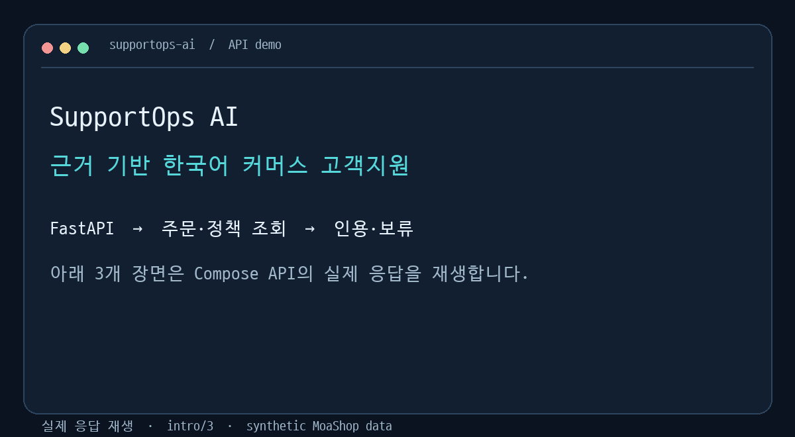
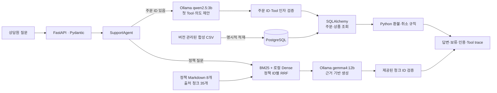

# SupportOps AI

**평가 가능한 근거 기반 한국어 커머스 고객지원 에이전트** · Applied AI Engineer 포트폴리오

가상의 쇼핑몰 MoaShop 상담원을 위한 읽기 전용 Copilot이다. 정책 질문에는 출처 청크를 찾아 답하고, 주문 질문에는 합성 주문·상품을 조회해 Python의 확정적 규칙으로 환불·취소 신청 가능 여부를 판단한다. 근거가 부족하면 보류한다. 실제 취소나 환불은 실행하지 않는다.



[데모 원본 응답](demo/api_examples.json) · [실행·캡처 방법](demo/README.md) · [GitHub Actions CI](https://github.com/binilab/SupportOps-ai/actions/workflows/ci.yml)

## 1. 실행해 보기

Docker Compose와 호스트에서 실행되는 Ollama가 필요하다. 로컬 모델 두 개를 내려받고 `.env`에 URL에서 사용 가능한 로컬 DB 비밀번호를 설정한다.

```bash
cp .env.example .env
# .env의 SUPPORTOPS_DB_PASSWORD 값을 변경
ollama pull qwen2.5:3b
ollama pull gemma4:12b
docker compose up -d --build
curl -sS http://127.0.0.1:8000/health
curl -sS http://127.0.0.1:8000/v1/answer \
  -H 'Content-Type: application/json' \
  -d '{"question":"ORD-1008 지금 취소 가능해?","as_of":"2026-10-05"}'
```

예시 응답은 `cancel_request_allowed`와 `policy_cancel_v1::01` 인용을 반환하며, 실제 취소는 실행하지 않았다고 명시한다. 없는 주문 `ORD-9999`는 보류한다. 정책 질문 `제주도는 배송비가 더 붙어?`는 `policy_shipping_v1::02`를 인용한다. 첫 정책 요청에는 임베딩 모델 다운로드가 필요해 오래 걸릴 수 있다. 자세한 시작·종료·장애 절차는 [Phase 7 실행 안내](docs/PHASE7_OPERATIONS.md)에 있다.

## 2. 실제 구현 구조



서비스의 정책 검색은 평가한 **로컬 Hybrid RRF** 경로를 사용한다. PostgreSQL/pgvector는 Phase 2에서 벡터 저장·조회와 로컬 검색 결과 일치를 검증했지만 API의 정책 검색 경로는 아니다. 주문·상품은 PostgreSQL에서 읽는다. 구조화 로그에는 요청 ID, 결과, 지연 시간과 Ollama가 제공한 토큰 수를 기록한다. 로컬 Ollama의 금전 비용은 추정하지 않는다. [API 계약과 오류](docs/PHASE6_SERVICE.md)

## 3. 고정 Gold와 검색 실험

Gold 40개 중 필수 정책 ID가 표시된 **37개**로 아래 검색 지표를 계산했다. 정책 8개와 청크 35개를 동일하게 유지했고, 필수 정책을 정책 ID 단위로 찾았는지 평가했다. 시간은 단일 로컬 실행의 검색 호출 중앙값이며 모델 적재와 문서 임베딩 생성은 제외한다.

| 검색 방법 | Recall@1 | Recall@3 | Recall@5 | MRR | 검색 중앙값 |
|---|---:|---:|---:|---:|---:|
| [BM25](reports/phase1_bm25_baseline.json) | 0.6081 | 0.8378 | 0.9459 | 0.7883 | 0.045 ms |
| [Dense 로컬](reports/phase2_dense_local.json) | 0.7297 | 0.8378 | 0.9189 | 0.8905 | 5.680 ms |
| [Dense pgvector](reports/phase2_dense_pgvector.json) | 0.7297 | 0.8378 | 0.9189 | 0.8905 | 7.071 ms |
| **[Hybrid RRF](reports/phase3_hybrid_rrf.json)** | **0.7432** | **0.9324** | **0.9730** | **0.9009** | 6.208 ms |

Hybrid는 같은 Gold에서 Dense 로컬 대비 Recall@3이 0.0946 높았고 중앙 검색 시간은 약 0.528 ms 길었다. 상위 5개에서 필수 정책을 놓친 질문은 BM25 2개, Dense 5개, Hybrid 1개다. Reranker는 구현하지 않았다. [검색 방법과 실패 분석](docs/PHASE3_RETRIEVAL.md)

## 4. 답변과 Tool 평가

| 평가 | 고정 집합 | 결과 | 지연 시간 중앙값 |
|---|---:|---:|---:|
| 정책 RAG 필수 사실 모두 포함, 수동 검토 | 답변 대상 25개 | **22/25** | 답변 대상 26.393초 |
| 정책 RAG 근거 충실도·청크 인용 정확성, 수동 검토 | 실제 답변 25개 | **각 25/25** | 위와 동일 |
| 정책 RAG 보류 정확성 | 보류 대상 15개 | **15/15** | 전체 40개 24.218초 |
| 주문 Workflow 첫 Tool·인자·전체 순서·판정·보류 | Tool 대상 11개 | **각 11/11** | 0.759초 |

[RAG 원본 출력](reports/phase4_rag_local.json)·[수동 검토](reports/phase4_review.json) / [Tool 원본 출력](reports/phase5_agent_local.json)·[수동 검토](reports/phase5_review.json). 수동 평가는 한 사람이 수행했다. Gold 질문을 구현 중에도 사용했으므로 이 값은 **개발 평가 결과**이며 미지 질문에 대한 일반화 성능이 아니다. 정책 RAG 전체 중앙 시간에는 모델 호출 없이 보류한 사례가 포함된다. 검색 수치를 답변 정확성으로 해석하지 않는다.

## 5. 남은 실패와 설계 선택

| 확인된 사례 | 관찰 | 현재 처리·한계 |
|---|---|---|
| `eval_0033` 오타가 있는 주문 취소 질문 | Hybrid Top 5에 필수 취소 정책이 없다 | 검색 품질의 남은 실패다. 주문 ID가 있는 API 경로는 별도로 주문 Tool을 검증한다. |
| `eval_0038`·`0039`·`0040` | RAG가 동일 옵션 재고 조건 또는 개별 쿠폰·상품 조건의 우선순위를 빠뜨렸다 | 인용 ID의 존재 검증만으로 답변의 모든 조건을 보장할 수 없다. |
| 첫 컨테이너 정책 요청 | 모델 다운로드·초기화까지 약 92초 | 임베딩 캐시 볼륨을 유지한다. 이 수치를 일반 응답 시간으로 사용하지 않는다. |
| 존재하지 않는 주문·미확인 하자·상품별 조건 | 데이터나 확인 결과가 부족하다 | 확정 판정을 하지 않고 보류한다. |

명확한 환불·취소 규칙은 LLM 추론이 아닌 Python 코드에 둔다. 모델 제안 주문 ID가 질문과 다르면 조회하지 않는다. LangChain과 LangGraph는 이 작은 검색·생성 경로와 고정된 후속 Tool 순서의 복잡도를 줄이지 않아 도입하지 않았다. 선택 이유와 효과는 [결정 기록](DECISIONS.md)에 있다. 실제 개인정보, 결제·환불 실행, 운영 인증, 클라우드 배포는 [제품 범위](PROJECT_SCOPE.md) 밖이다.

## 6. 검증과 문서

```bash
python3 -m pip install -e '.[dev]'
python3 scripts/validate_gold_dataset.py
python3 -m pytest -q
python3 scripts/evaluate_hybrid.py
```

DB를 포함한 전체 pytest에는 별도 PostgreSQL/pgvector 테스트 DB의 `SUPPORTOPS_TEST_DATABASE_URL`이 필요하다. 없으면 DB 통합 테스트 2개를 건너뛴다. CI는 DB를 준비해 전체 25개를 실행한다. RAG·Tool 평가는 로컬 Ollama 모델 digest와 수동 검토에 묶인 별도 실험이다. [재현 절차](docs/PHASE7_OPERATIONS.md) · [면접 질문·답변](docs/INTERVIEW.md) · [현재 단계](PROGRESS.md)

핵심 데이터는 출처와 ID가 유지되는 **합성 MoaShop 데이터**다: [정책](data/raw/policies), [주문·상품](data/raw/structured), [Gold 평가셋](data/eval/gold_dataset.jsonl). 저장소의 예시는 실제 고객 데이터가 아니다.
